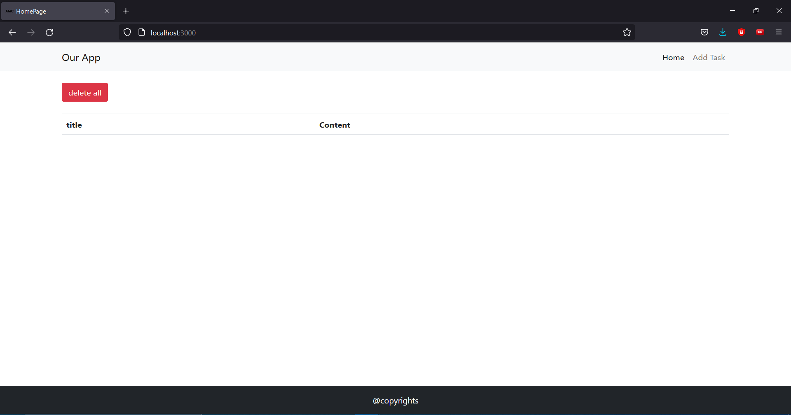
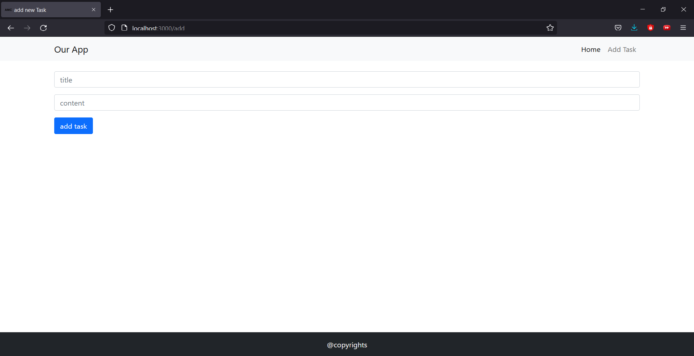
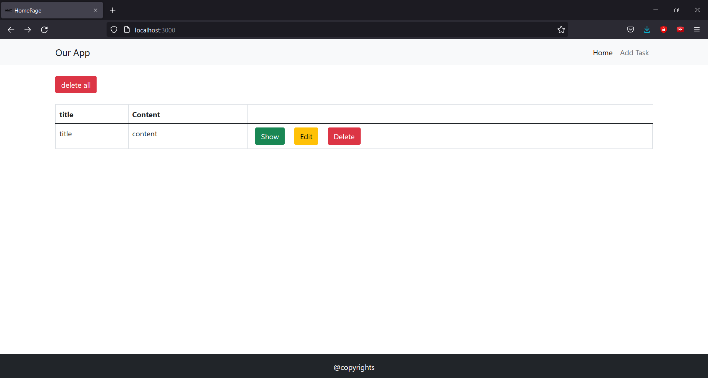
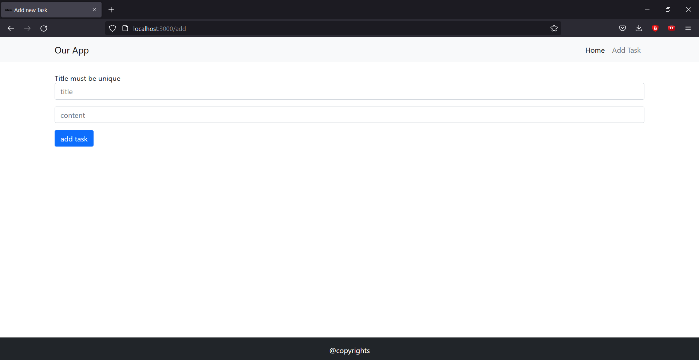
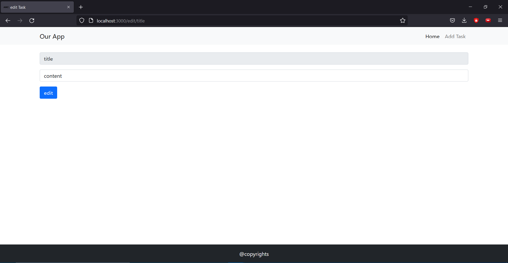
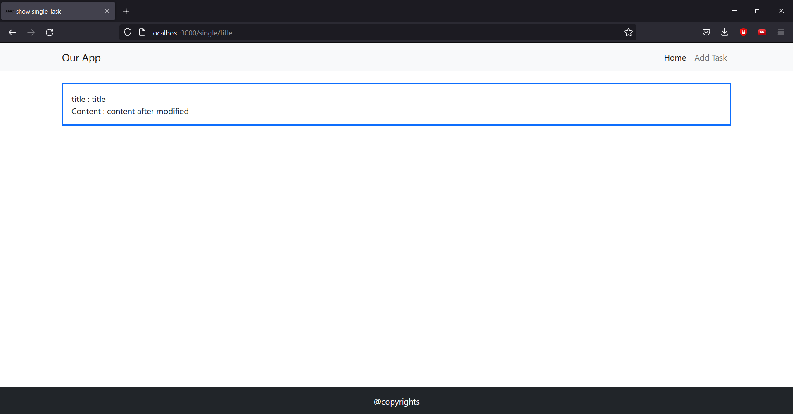

## About

This is a task for testing using of nodejs with hbs engine of html.
It is a simple task app that can add, delete, update and show tasks.
the structure of the code is:

-  index.js is the main file that will run the program.
-  frontend/view is the folder that contain all the frontend hbs files.
-  frontend/layouts is the folder that contain all the common frontend hbs files.
-  dealWithData.js is the main file that deals with json file either by input or output.
-  models/data.json is the json file that we are using to store data

## 💻 Built Using 

- [Nodejs]()
- [hbs]()

## how to start

If you want to start the app, you have to type `node index.js` in the console.

## 📷 Screenshots

    
## if you open index.html you will find

   

## if you click add task you will find this

    

  
## if everything is ok you will find this

   

  
## else if the title is not unique you will find this

   

## if you want to edit content of one task you can click on edit and you will find this

    

  
## then you want to see only one task , you can click on show on the task and you will find this

   

Happy tasks list :)
