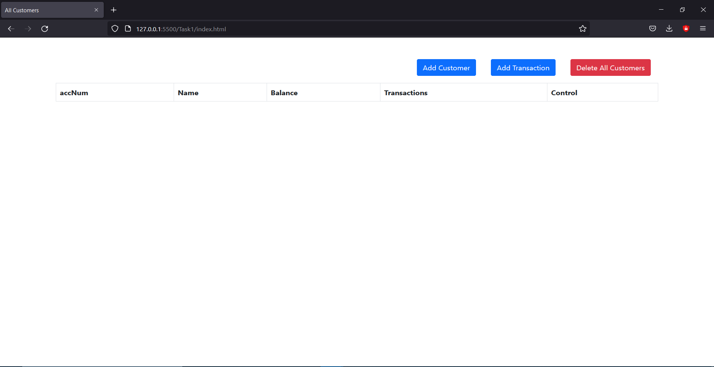
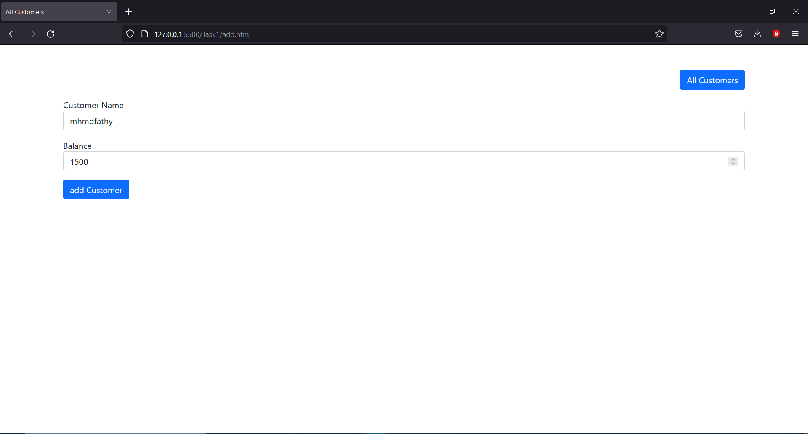
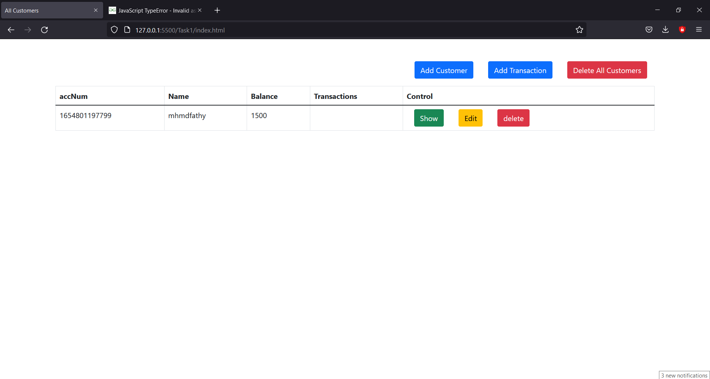
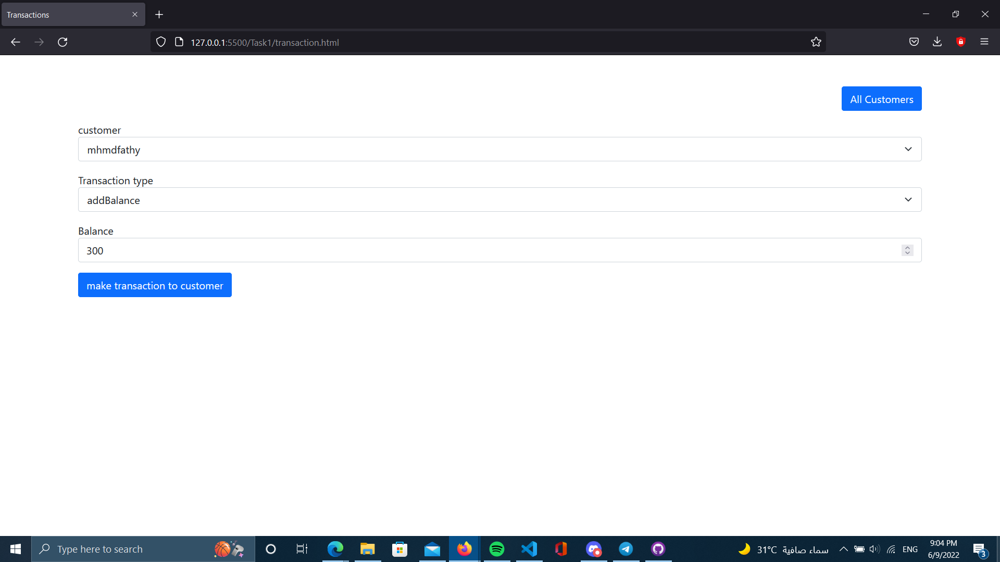
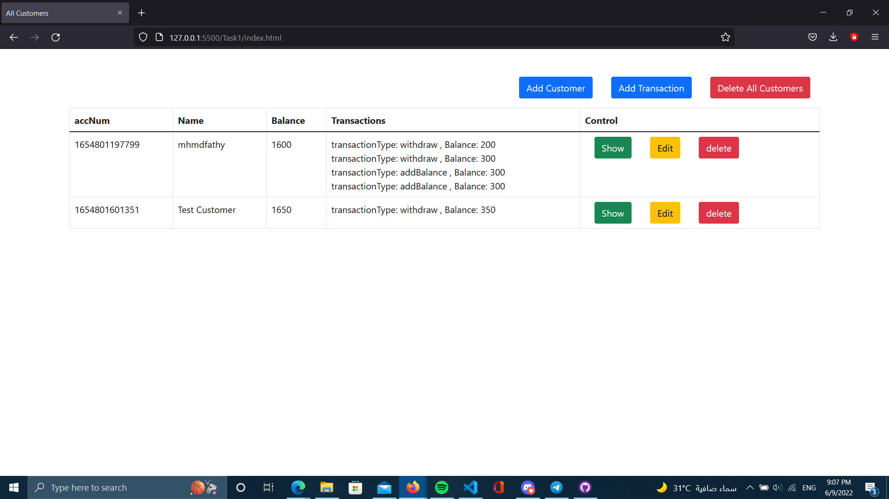
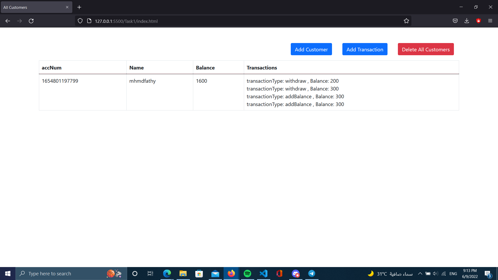

## About
   
   (Mongoose_Task1)
   this is simulation of bank which you can add clients and do more than one transaction for each client and
   save all this informations in mongoose

## 💻 Built Using 
- [HTML]()
- [BootStrap]()
- [Javascript]()

## 📷 Screenshots

    
## if you open index.html you will find

   

## if you click add client you will find this

    

  
## then you have add client 

   

  
## if you want to make transaction , you simple click on add transaction and you will find this
### if you want to make transaction you have to choose client from list of clients that were added and then choose type of transaction if you want to make deposit or withdraw

   

## after many transaction on many clients , you will find this

    

  
## then you want to see one client , you can click on show that is found in client  and you will find this

   

Happy bank transactions and happy coding :)
